# Visualization
Examples of my information visualizations

## PlantUML

### Sphinx Documentation Generation Workflow

### Documentation CI/CD Pipeline
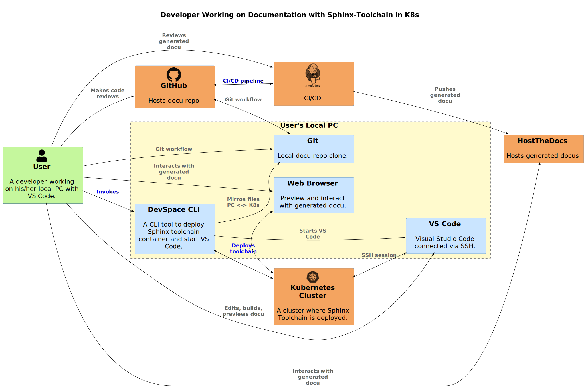

## GraphViz

### Swift

#### My-Swift-Project-Ecosystem
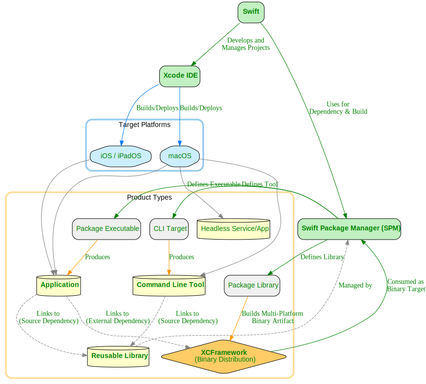

#### LangQuiz: Multi-Modal Architecture
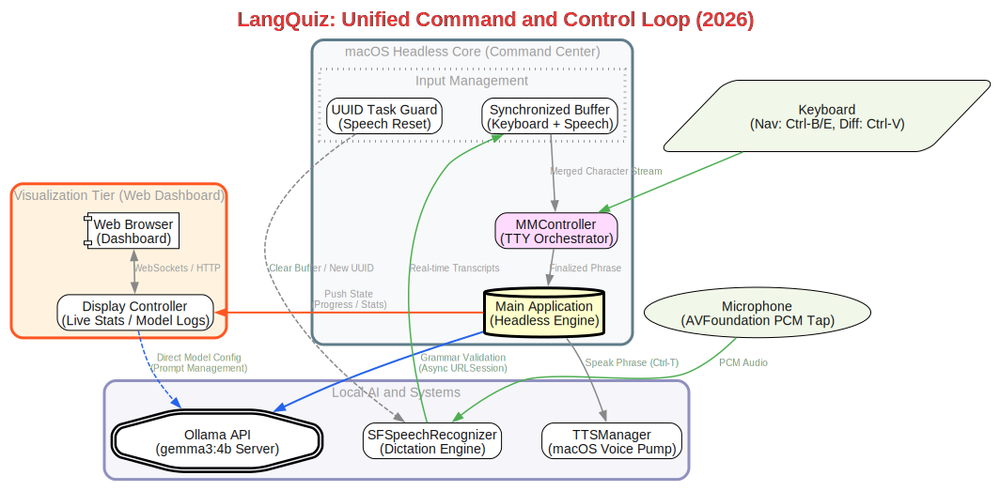

#### Project Technical Roadmap (geo-coord-classifier)

#### Xcode Project Build Dependency Graph (geo-coord-classifier)

### Traceability Transition Model
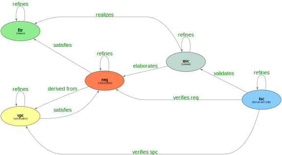

## Mermaid

### LangQuiz

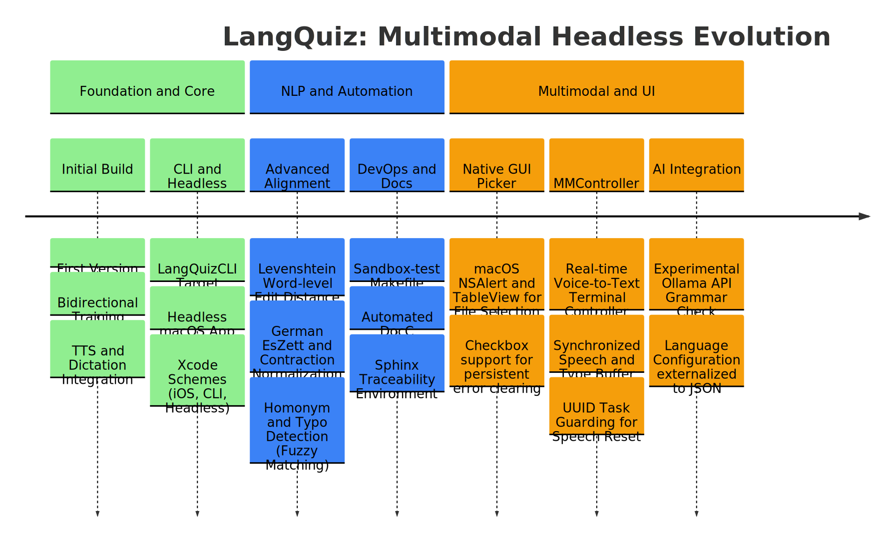

## JavaScript

### Software Stack
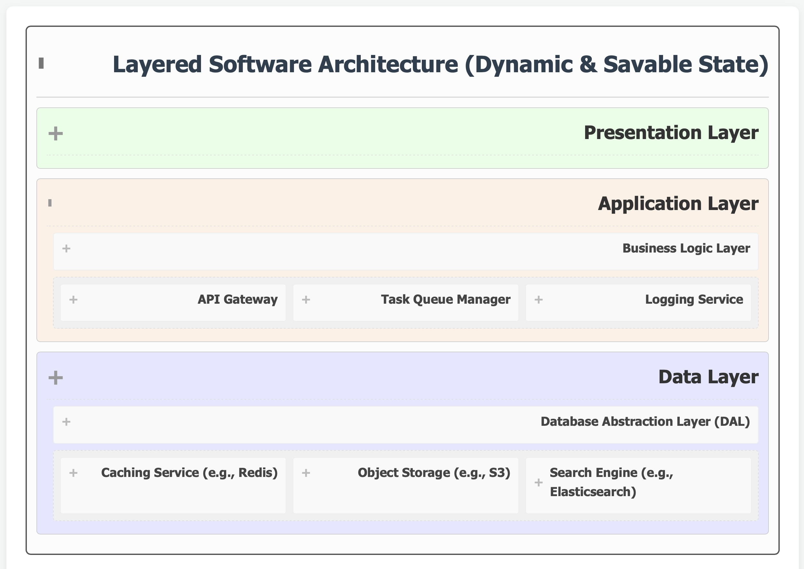

### vis-network.js

#### Traceability
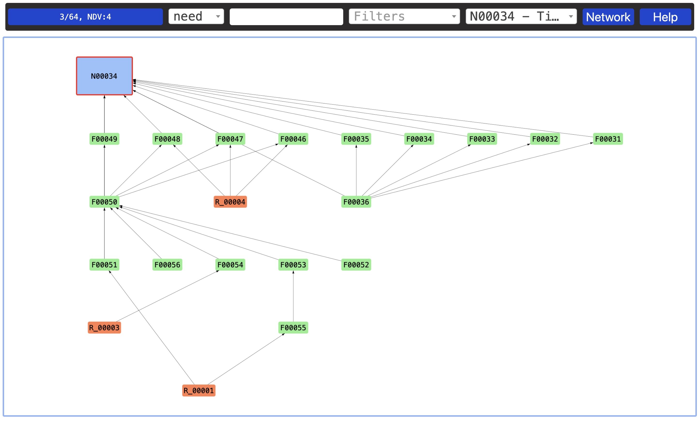

### d3.js

#### AI-Prompt-Engineering
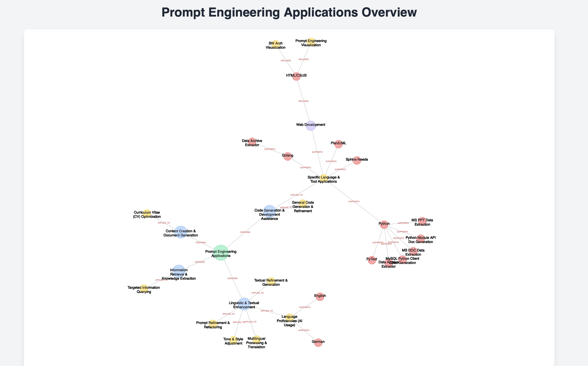

## OmniGraffle

### Packaging Software With Conan
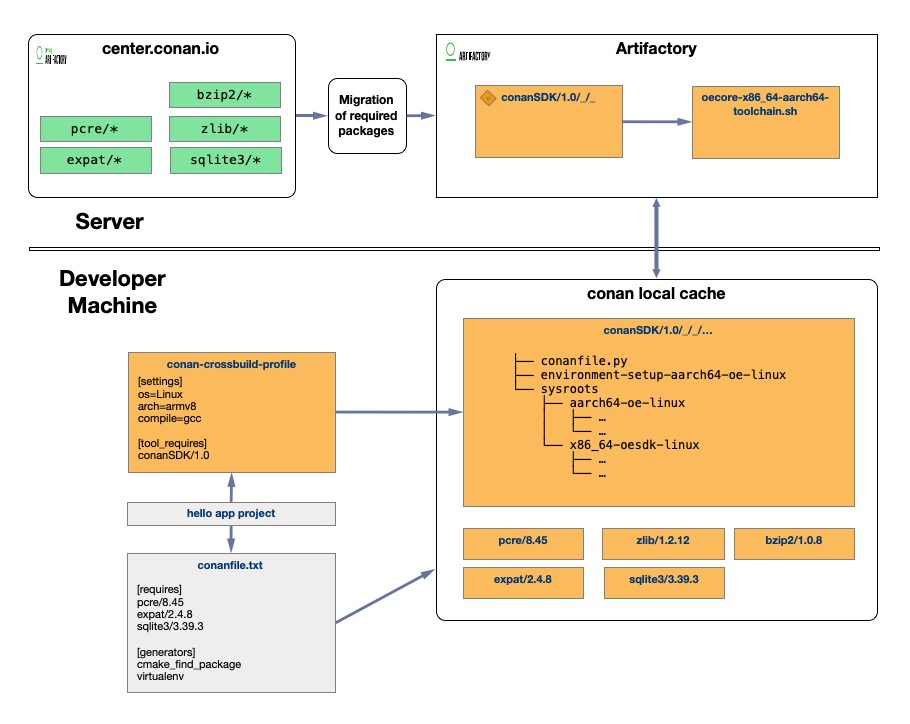

### Self Attention
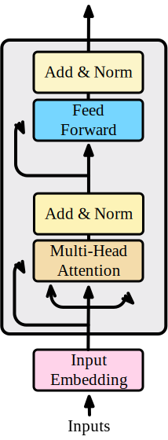

### WardleyMaps
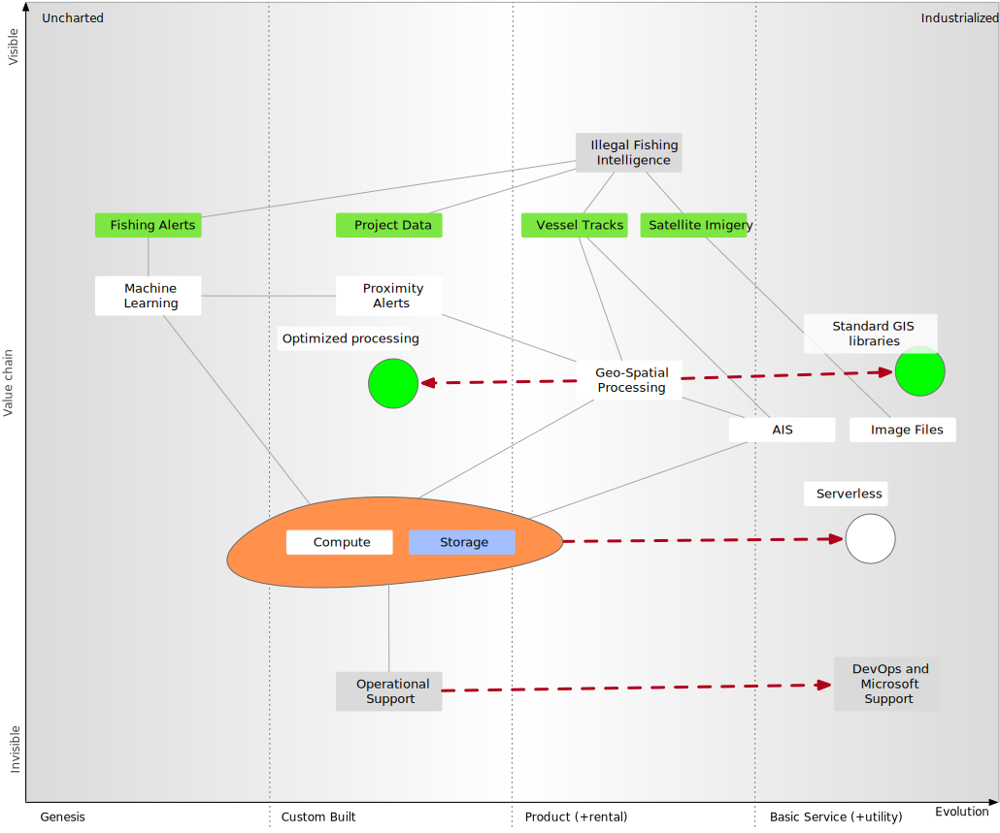

## MatplotLib

### Concept2
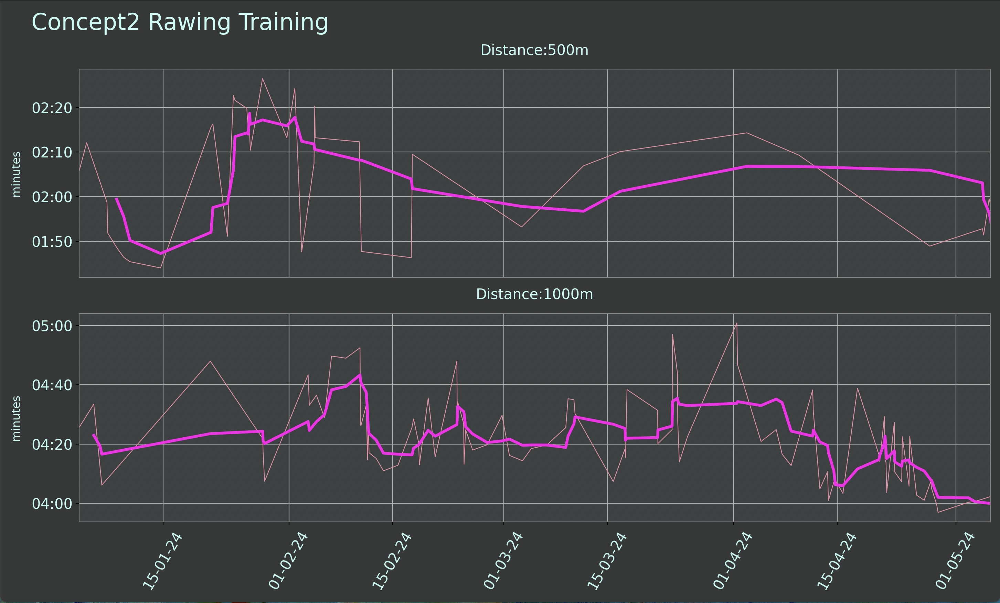

### Diesel Price Trends
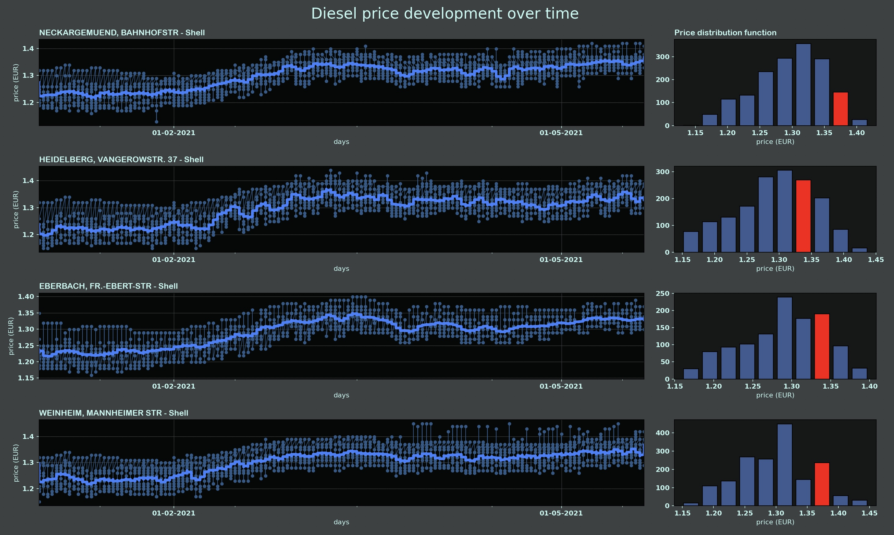

### Price Trends on Amazon
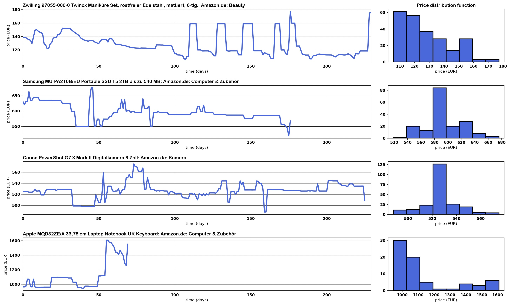

## Plotly
### COVID-19 Impact in Selected Countries
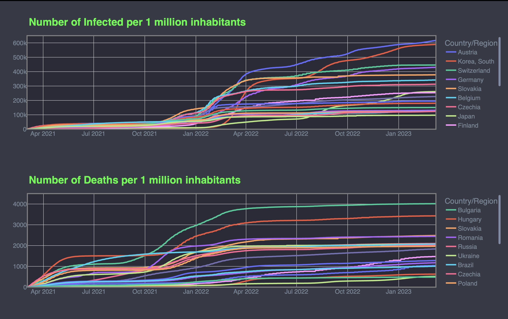