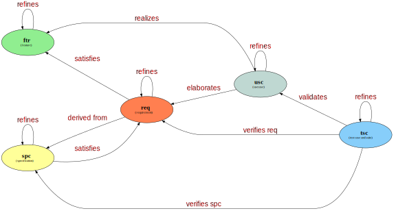

# Visualization
Examples of my information visualizations

## PlantUML

### Sphinx Documentation Generation Workflow

### Documentation CI/CD Pipeline

## GraphViz

### Swift

#### My-Swift-Project-Ecosystem

#### LangQuiz: Multi-Modal Architecture

#### Project Technical Roadmap (geo-coord-classifier)

#### Xcode Project Build Dependency Graph (geo-coord-classifier)

### Traceability Transition Model

## Mermaid

### LangQuiz

## JavaScript

### Software Stack

### vis-network.js

#### Traceability

### d3.js

#### AI-Prompt-Engineering

## OmniGraffle

### Packaging Software With Conan

### Self Attention

### WardleyMaps

## MatplotLib

### Concept2

### Diesel Price Trends

### Price Trends on Amazon

## Plotly
### COVID-19 Impact in Selected Countries
